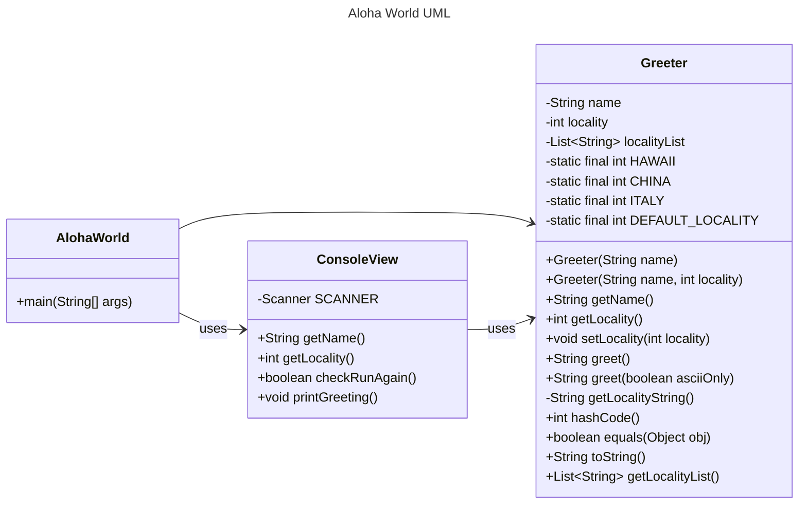

# Homework Aloha World Report

The following report contains questions you need to answer as part of your submission for the homework assignment. 

## Design Doc
Please link your UML design file here. See resources in the assignment on how to
link an image in markdown. You may also use [mermaid] class diagrams if you prefer, if so, include the mermaid code here.  You DO NOT have to include Greeting.java as part of the diagram, just the AlohaWorld application that includes: [AlohaWorld.java], [Greeter.java], and [ConsoleView.java].

### Program Flow
Write a short paragraph detailing the flow of the program in your own words. This is to help you understand / trace the code (and give you practice of something called a code walk that will be required in this course).

The AlohaWorld class has a main method that is the program entry point. It uses a ConsoleView object (which need not be instantiated) to collect user input values for name and locality. A new Greeter object, which functions like a dataclass, is then instantiated with these values. The ConsoleView then uses the Greeter object to print a greeting for the user. There is a loop inside AlohaWorld's main method to optionally provide another greeting for the user using the same flow control. It appears that the Greeting class is not actually used and is only for instructional purposes.

## Assignment Questions

1. List three additional java syntax items you didn't know when reading the code.  (make sure to use * for the list items, see example below, the backtick marks are used to write code inline with markdown)
   
   * String.format()
   * %%s
   * static

2. For each syntax additional item listed above, explain what it does in your own words and then link a resource where you figured out what it does in the references section. 

    * The String.format() method is used for string interpolation in Java, so you can insert values into a string by invoking the method e.g. String.format("Hello, %s!", this.name). The method is capable of interpolating the return values from functions as well.
    * The %%s placeholder is used to reserve a string placeholder for a superior interpolation in a situation where you only want to insert one value into a string containing multiple placeholders. This was necessary to use for the Greeter class where we wanted to interpolate the ascii/unicode greeting for the instance and needed to leave the other %s string placeholder in place (because it would be interpolated later by another call to String.format())
    * The static keyword is used before a class attribute to allow access to the attribute without instantiating the class. This is useful because there are cases where you might have a utility class that has values you need to work with, but don't necessarily need to create an instance of the class. More specifically, I used this keyword when defining constants in the Greeting class that I wanted to use in the constructor for the class itself. Without the static keyword, this would not have been possible.

3. What does `main` do in Java? 

   `main` is the entry point for program execution and makes calls to other methods/classes to orchestrate overall program flow 

4. What does `toString()` do in Java? Why should any object class you create have a `toString()` method?

    `toString()` is a built in class method that gets overwritten. It is intended to print out a string representation of the object to the console. The exact format and attributes printed to the console might be different between objects which is why this built in method often gets overwritten.

5. What is javadoc style commenting? What is it used for? 

    javadoc style commenting is a docstring format that is used to generate html formatted documentation for the public attributes and methods of a class.

6. Describe Test Driving Development (TDD) in your own words. 

    Test Driven Development is the practice of writing unit tests first to define basic inputs and outputs for a class, and then writing an implementation of the class or object that will pass the test. Then more tests are written that serve as the specification for additional behaviors/outputs for the class or object, and the implementation is extended to pass these tests, and so on until something is feature complete.

7. Go to the [Markdown Playground](MarkdownPlayground.md) and add at least 3 different markdown elements you learned about by reading the markdown resources listed in the document. Additionally you need to add a mermaid class diagram (of your choice does not have to follow the assignment. However, if you did use mermaid for the assignment, you can just copy that there). Add the elements into the markdown file, so that the formatting changes are reserved to that file. 

## Deeper Thinking Questions

These questions require deeper thinking of the topic. We don't expect 100% correct answers, but we encourage you to think deeply and come up with a reasonable answer. 

1. Why would we want to keep interaction with the client contained to ConsoleView?
   
    Confining all the client interaction behavior to the ConsoleView class makes the code more modular, reusable and easier to debug. For example, if you combined the Greeter and ConsoleView objects, it might be more difficult to isolate issues with validating user input, writing tests etc. Additionally, modularizing the code in this way makes it more reusable. If you added localities, for example, this would require no changes to the ConsoleView class.

2. Right now, the application isn't very dynamic in that it can be difficult to add new languages and greetings without modifying the code every time. Just thinking programmatically,  how could you make the application more dynamic? You are free to reference Greeting.java and how that could be used in your design.
   
    Currently all of the logic around how greetings are displayed is located in the Greeter class. However, in Greeting.java we implemented generalized logic for displaying greetings based on how many arguments are supplied during class instantiation. We could implement a hashmap in the Greeter class to map language-specific greetings to locales, and then instantiate Greeting objects based on the hashmap, which could then be called to display a proper greeting. Then all we would have to do to add a greeting is update the hashmap with the correct values, rather than hard-coding conditional logic based on the locale.

> [!IMPORTANT]
>  After you upload the files to your github (ideally you have been committing throughout this progress / after you answer every question) - make sure to look at your completed assignment on github/in the browser! You can make sure images are showing up/formatting is correct, etc. The TAs will actually look at your assignment on github, so it is important that it is formatted correctly.

## References

[^1]: Final keyword in Java: 2024. https://www.geeksforgeeks.org/final-keyword-in-java/. Accessed: 2024-03-30. 

[^2]: Math (Java Platform SE 17). https://docs.oracle.com/en/java/javase/17/docs/api/java.base/java/lang/Math.html. Accessed: 2024-03-30.

<!-- This is a comment, below this link the links in the document are placed here to make ti easier to read. This is an optional style for markdown, and often as a student you will include the links inline. for example [mermaid](https://mermaid.js.org/intro/syntax-reference.html) -->
[mermaid]: https://mermaid.js.org/intro/syntax-reference.html
[AlohaWorld.java]: src/main/java/student/AlohaWorld.java
[Greeter.java]: src/main/java/student/Greeter.java
[ConsoleView.java]: src/main/java/student/ConsoleView.java